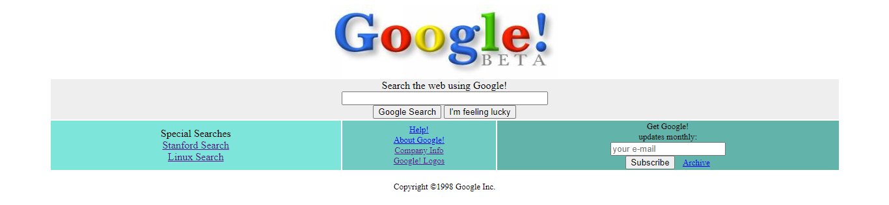

# GoogleHomePage
Patika Dev CSS kursundaki ödevlerden biri olan Google'ın ana sayfasının görünümünü hazırladığım HTML sayfalarını içerir.
## 2 adet ödev mevcuttur.
### İlk ödev 1998 yılına ait Google ana sayfasını yapmaydı. Bu ödev oldGoogle.html adındadır.
#### Eski etiketler yerine güncel etiketler kullanılmıştır.
### İkinci ödev ise vermiş olduğunuz güncel Google sayfasındaki eksiklikleri ve bozulmaları düzeltmekti. Bu çalışmam ise newGoogle.html içerisindedir.
#### Webarchive görünümünden uyarlanmıştır.
[1998 Google Home Page Webarchive Link](https://web.archive.org/web/19981202230410if_/http://www.google.com/)

[2019 Google Home Page Webarchive Link](https://web.archive.org/web/20191130234759if_/https://www.google.com/)

